

  

# Gardening and Plant E-Commerce Management System

## About the Project

Gardening and Plant E-Commerce Management System is a **full-stack web application** designed to manage indoor plant sales and inventory efficiently.  
It provides a seamless experience for **sellers**, **customers**, **guest**, and **admins**, combining e-commerce functionality with role-based access control.

Key highlights:

-   **Guest** – Browse and view products
-   **Customer** – Register, purchase, and track orders
-   **Seller** – Manage products, inventory, and customer orders
-   **Admin** – Manage users, approve & reject product, monitor system activities

---

## Features

-   **Role-Based Access Control:** Separate dashboards for Admin, Seller, Customer, Guest
-   **Product Management:** Add, edit, delete products with categories, sunlight requirements, water frequency, difficulty levels, growth stage, health & condition
-   **Inventory Management:** Track stock levels and product availability
-   **Order Management:** Process orders, tracking and update statuses
-   **Filtering & Search:** Customers can filter products by category, price, difficulty, and sunlight needs, and growth stage
-   **Responsive UI:** Works across desktops, mobile

---

## Technologies Used

-   **Back-End:** PHP (Laravel Framework)
-   **Front-End:** HTML, CSS, JavaScript
-   **Database:** MySQL
-   **Version Control:** Git & GitHub

---

## Screenshots

  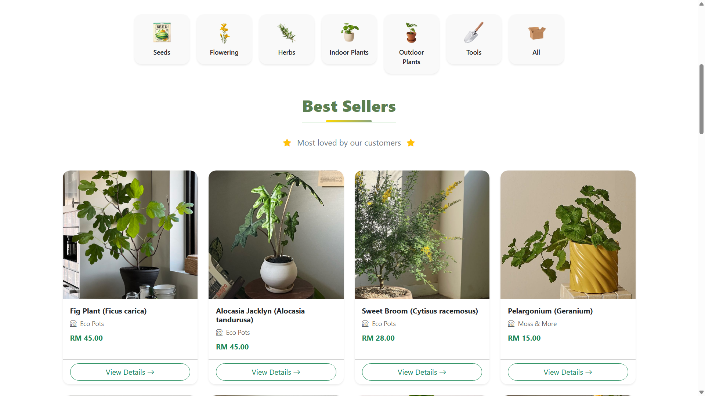
  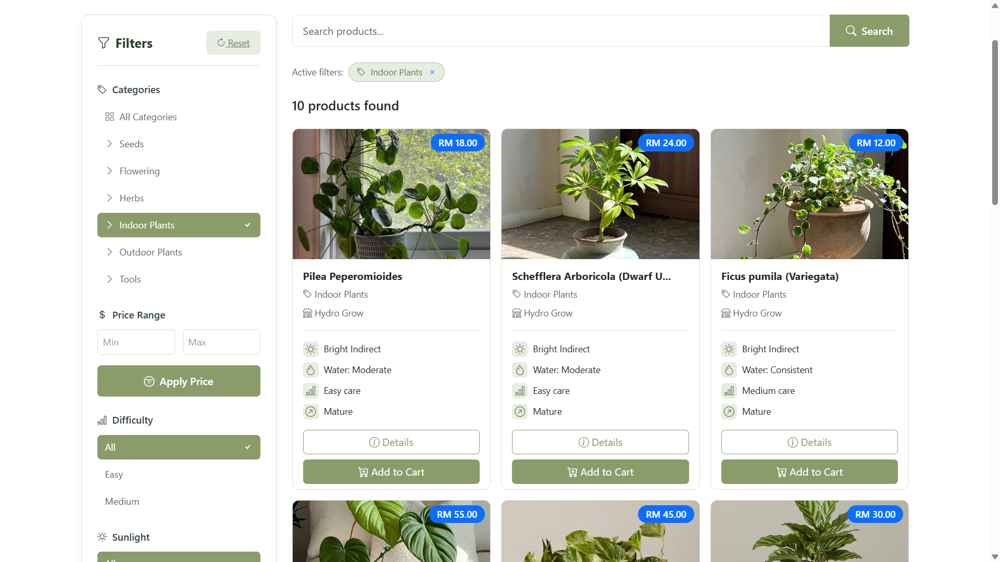
  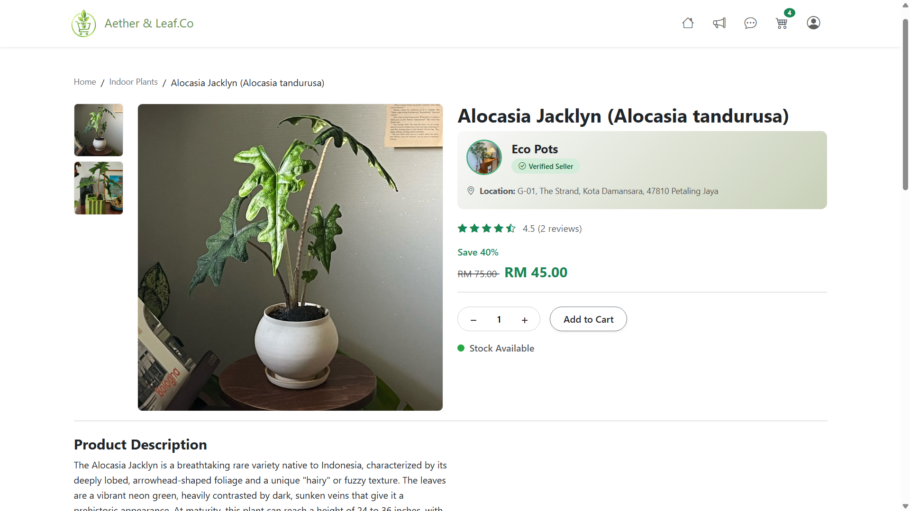
  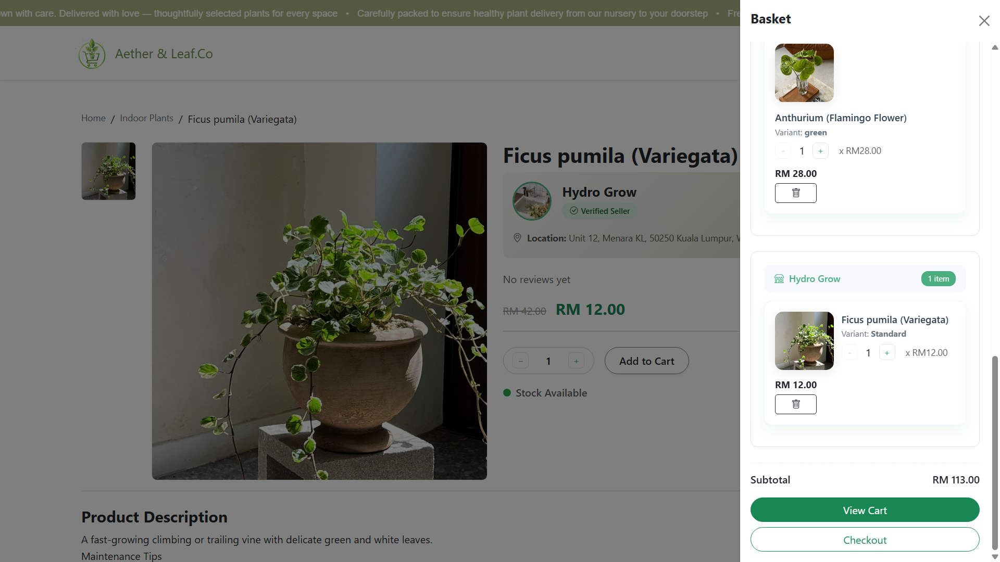
  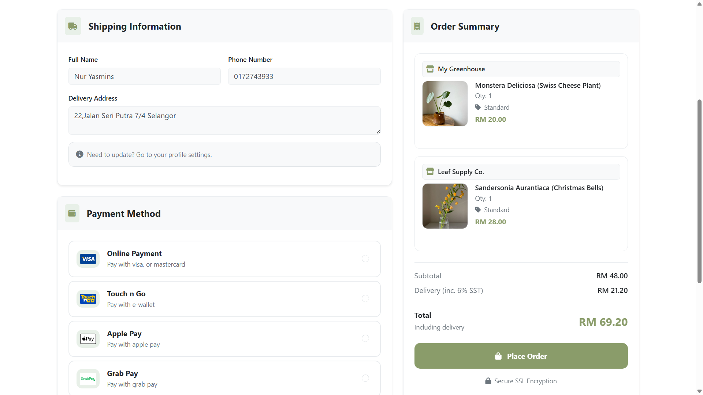
  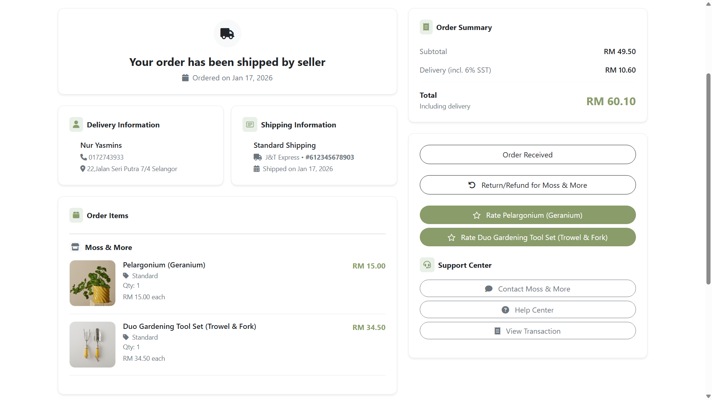
  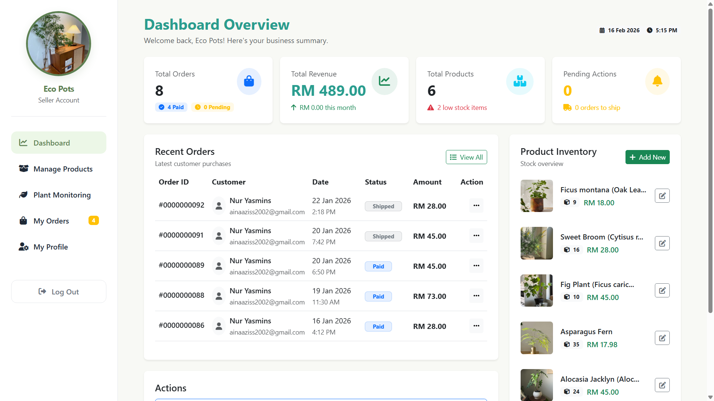
  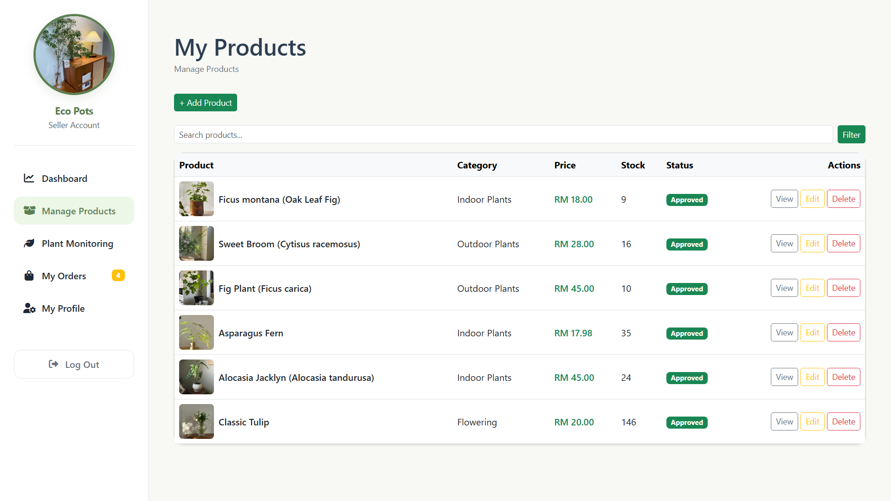
  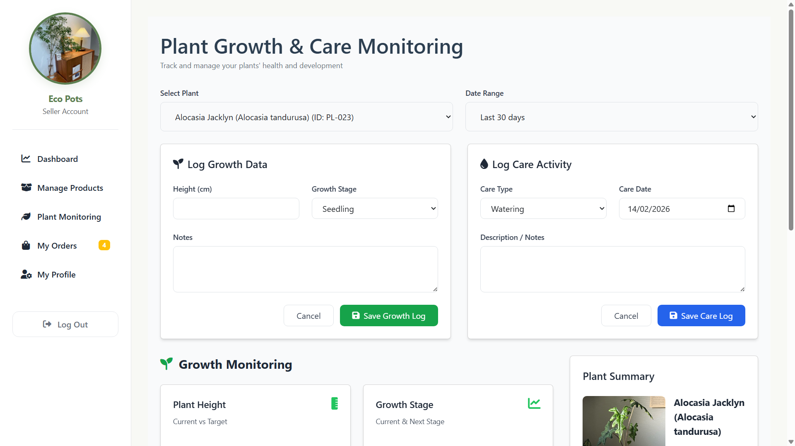
  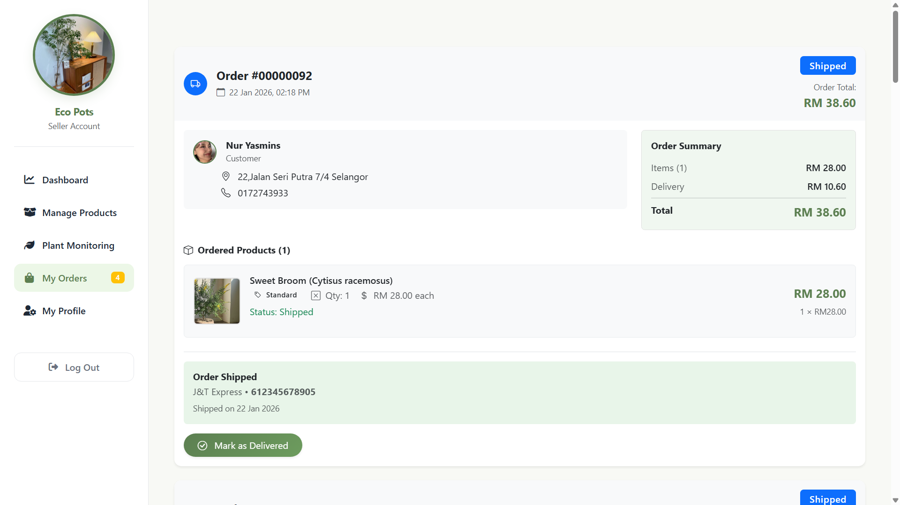
  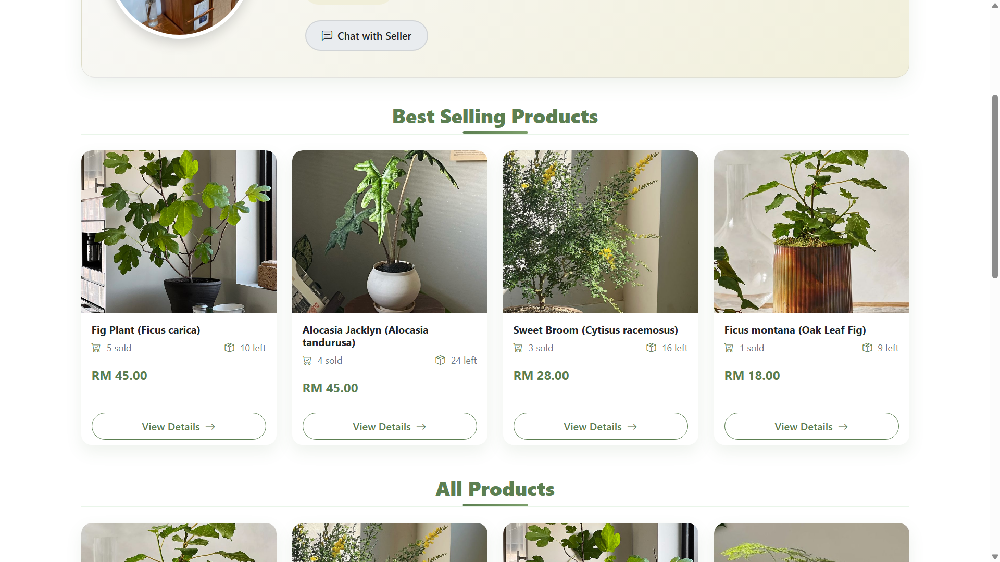
  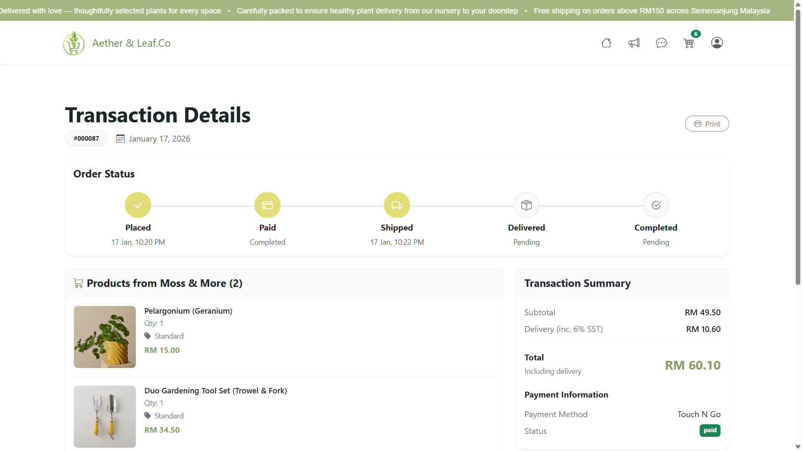
  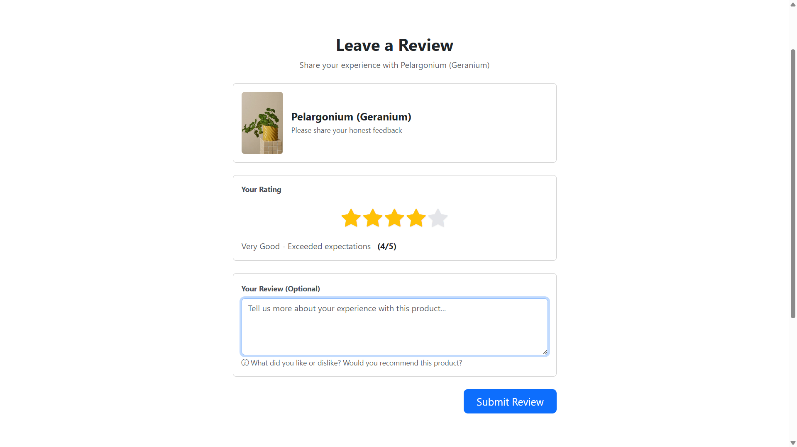

