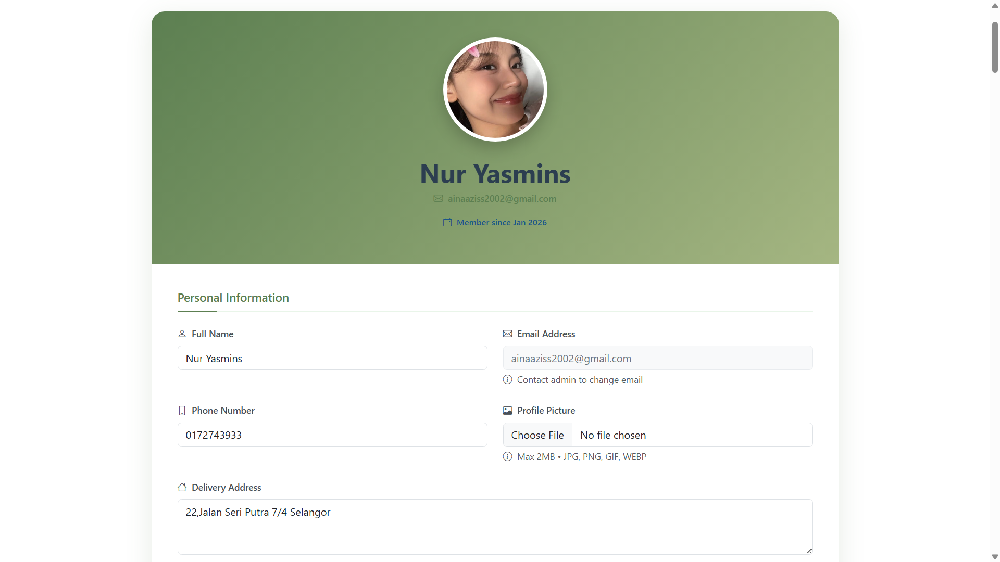
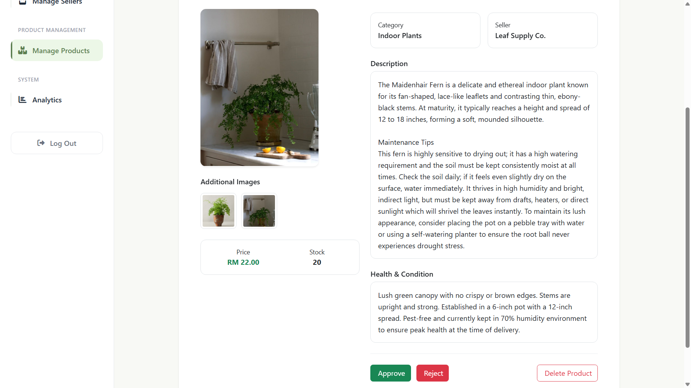
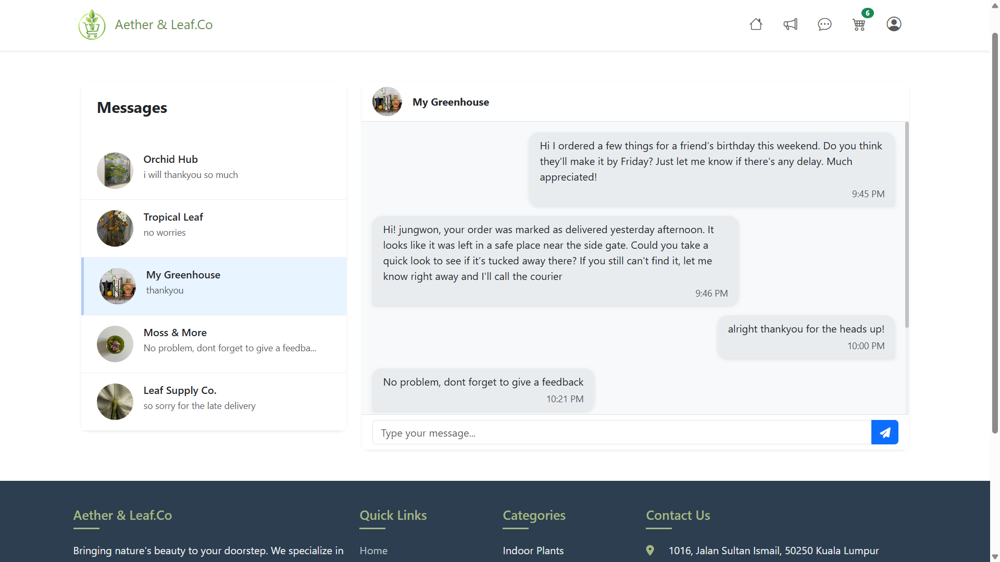
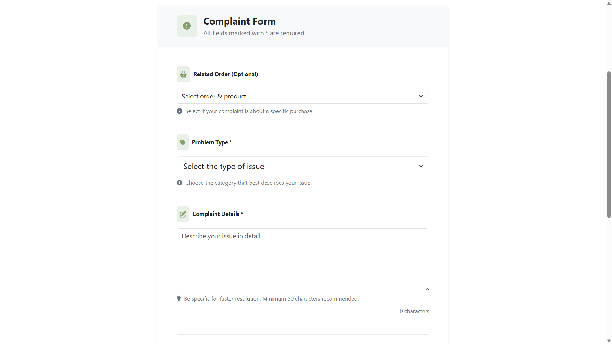

  

# Gardening and Plant E-Commerce Management System

## About the Project

A full-stack web-based e-commerce platform designed for nursery management and online plant sales.
This system digitalizes traditional nursery operations by integrating real-time inventory management, plant verification, order processing, and customer relationship management (CRM) into a centralized platform.

## Project Overview

Developed as a Final Year Project, this system addresses limitations in existing agricultural e-commerce platforms:

Lack of real-time stock synchronization

Absence of structured plant quality verification

Poor integration between nursery operations and customer-facing systems

The system supports four user roles:
👤 Guest | 🛒 Customer (Buyer) | 🌱 Nursery Owner (Seller) | 🛠️ Administrator

---

## Key Features

🔐 **User Authentication & Role-Based Access**

-   Secure registration & login

-   Role-based dashboard redirection

-   Profile management

-   Admin user management

🌿 **Plant Catalog & Browsing**

-   Advanced search & filtering (category, price, difficulty, sunlight, growth stage)

Product detail page with:

-   Product description and Plant care information

-   Sunlight Requirements, watering frequency, difficulty level, and growth stage

-   Seller verification status

-   Customer reviews

📦 **Inventory & Plant Management**

-   Add / edit / delete products

-   Upload plant images

-   Update stock levels

-   Automatic stock synchronization after each completed transaction

🛒 **Order & Payment Processing**

-   Add to cart functionality

-   Checkout system with order summary & total calculation

-   Multiple payment options

-   Order tracking & status updates

🌱 **Plant Monitoring Module**

Sellers can record:

-   Plant growth stage

-   Height

-   Care activities (watering, fertilizing, etc.)

Notes & observations

💬 **Customer Relationship Management (CRM)**

-   Complaint submission

-   Review & rating system

-   Real-time messaging (Service Desk)

-   FAQ & self-help resources

📊 **Seller Dashboard**

-   Total orders overview

-   Revenue tracking

-   Pending actions

-   Complaint & return management

---

## Technologies Stack

-   **Back-End:** Laravel 10.49.1 (MVC), PHP
-   **Front-End:** Laravel Blade, HTML, CSS, Bootstrap, JavaScript
-   **Database:** MySQL
-   **Version Control:** XAMPP, phpMyAdmin, VS Code, GitHub, Figma, Draw.io

---

## System Architecture

-   **Models:** Handle database logic using Eloquent ORM
-   **Views:** Blade templates for dynamic rendering
-   **Controllers:** Manage business logic and request handling
-   **Middleware:** Role-based access control

---

### Database Design

The system uses a normalized relational database (MySQL) to ensure data integrity, scalability, and structured transaction management.

### Relationship Structure

The database is designed with proper primary keys and foreign key constraints to maintain referential integrity.

**One-to-many relationships:**

User → Orders

Seller → Products

Category → Products

Cart → CartItems

Order → OrderItems

**Many-to-many relationships (resolved using pivot tables):**

Orders ↔ Products (via order_items)

Carts ↔ Products (via cart_items)

Database integrity and consistency are maintained through proper relational design, and inventory updates automatically after transactions.

The ERD (Entity Relationship Diagram) was designed prior to implementation to ensure proper normalization and modular system structure.

---

## System Modules

-   Home Page

-   Browse Page

-   Product Detail Page

-   Cart & Checkout

-   Buyer Profile

-   Seller Dashboard

-   Manage Orders

-   Manage Products

-   Complaint & Review System

-   Service Desk Messaging

---

## Screenshots

  
  
  
  
  
  
  
  
  
  
  
  
  
  
  
  
  
  

